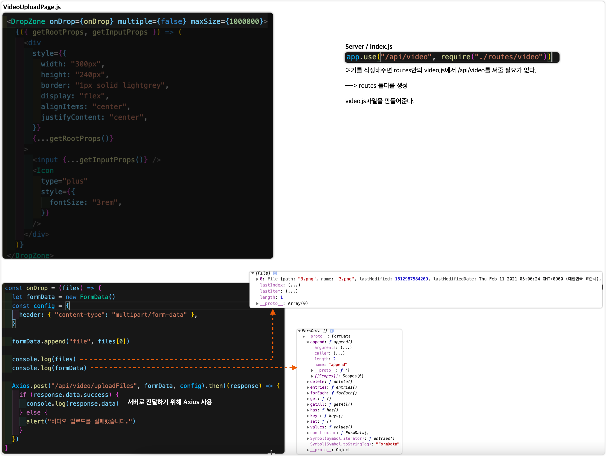
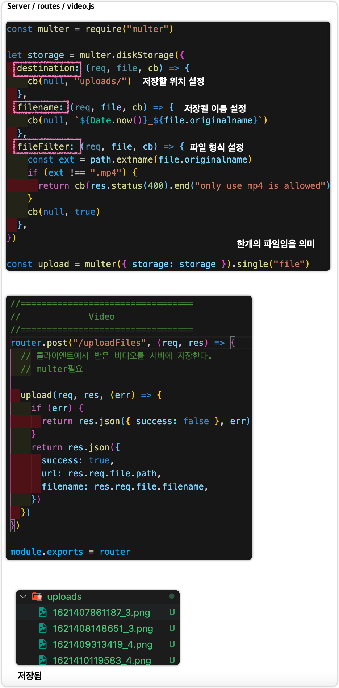

# Multer

 **노드 서버에 비디오 저장**

1.  Dependancy 다운로드 `npm install multer`
2. 비디오 파일을 서버에 보내기
3. 받은 비디오 파일을 서버에서 저장
4. 파일 저장경로를 클라이언트에 다시 알려주기

## 클라이언트 부분

## 서버 부분

1. npm install multer로 multer를 설치해준다.

# Thumbnail 

## ffmpeg 

